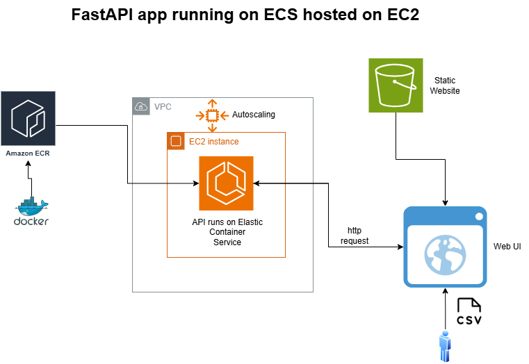

# 🏃 RunAnalyzer - ECS FastAPI Application

**RunAnalyzer** is a fully containerized **FastAPI** application deployed on **AWS ECS (EC2 launch type)** with an **S3-hosted web UI**. 
This project showcases the ability to build **scalable cloud applications**, automate infrastructure with **AWS CDK**, and integrate **Docker, ECS, and S3** 
in a clean architecture.
The application generates statistics and charts when provided with the .csv file containing running activities data, that can be downloaded from 
the Garmin Connect website.

## 🚀 Features

- 📊 **FastAPI Backend**: Analyzes running activity data and generates visual statistics.
- 🐳 **Containerized with Docker**: Packaged as a container and pushed to **AWS ECR**.
- ☁ **Deployed on ECS (EC2 launch type)**: Running as an **ECS Service** with an **Auto Scaling Group**.
- 🌐 **Frontend Hosted on S3**: A lightweight web UI to interact with the API.
- 🔄 **Fully Automated with AWS CDK**: Infrastructure as code for **seamless deployment**.

---

## 🏗 Architecture Overview

- **FastAPI application**: Receives and processes running data.
- **Docker container**: Built locally and pushed to **AWS ECR**.
- **ECS (EC2 launch type)**: A single task runs on an EC2 instance within an **Auto Scaling Group**.
- **S3 for UI hosting**: The frontend communicates directly with the FastAPI backend.
- **Security & Networking**: EC2 runs in a **VPC with a security group**, exposing API ports.



---

## 📌 Steps to Deploy

A docker image of the Python FastAPI application can be created using the dockerfile stored in ```/runAnalyzerAPI```

### 1️⃣ **FastAPI Application Development**
- Built a **FastAPI** app to process running data and generate statistics.
- Configured **CORS middleware** to allow requests from the S3-hosted UI.

### 2️⃣ **Docker Containerization**
- Created a `Dockerfile` to package the FastAPI app into a container.
- Built and tested the image locally:
  ```sh
  docker build -t run-api-repo:latest .
  docker run -p 8000:8000 run-api-repo:latest
   ```
  
  
  
### 3️⃣  **Push Image to AWS ECR** 
- Authenticate Docker with ECR:

``` 
aws ecr get-login-password --region eu-central-1 | docker login --username AWS --password-stdin <aws_account_id>.dkr.ecr.eu-central-1.amazonaws.com

```

- Tag and push the image:

``` docker tag run-api-repo:latest <aws_account_id>.dkr.ecr.eu-central-1.amazonaws.com/run-api-repo:latest``` 


```docker push <aws_account_id>.dkr.ecr.eu-central-1.amazonaws.com/run-api-repo:latest``` 

### 4️⃣  **Deploy Infrastructure with AWS CDK**

The AWS CDK script defines:

- **VPC & Security Groups**
- **ECS Cluster & Auto Scaling Group**
- **ECS Task & Service**
- **S3 Bucket for Web UI**

- Deploy the stack:

``` 
cdk deploy

```

### **How It Works**
-Frontend (S3) calls the FastAPI backend (ECS on EC2).
-FastAPI processes the request and returns running statistics.
-CORS Middleware ensures the web UI can access the API.
-ECS handles deployment of new container versions via aws ecs update-service.


## 📝 Notes
- **No API Gateway** is used – the UI directly calls the ECS-hosted FastAPI app.
- **CORS issues** were fixed by allowing the correct S3 frontend origin.
- **The EC2 instance's public IP is dynamically assigned**, requiring updates in the UI.

## 📌 Future Enhancements
✅ **Use API Gateway + Lambda** instead of EC2 for a fully serverless approach.  
✅ **Automate frontend updates** by dynamically injecting the API URL into the UI.

## 🏆 Key Takeaways
This project demonstrates:
- **Building containerized applications** with Docker & FastAPI.
- **Deploying and managing AWS ECS workloads** using AWS CDK.
- **Hosting frontend applications in AWS S3**.
- **Handling CORS for API security**.

🚀 **AWS CDK + ECS + Docker = Fully Automated Cloud Deployment** 🚀

